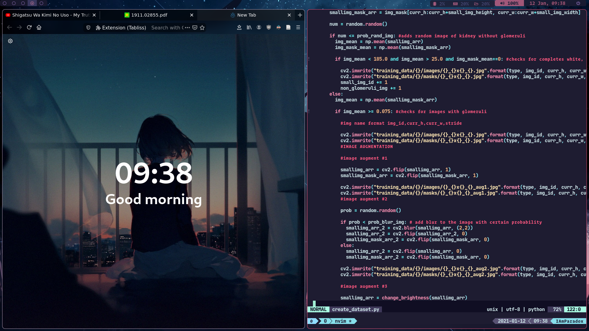
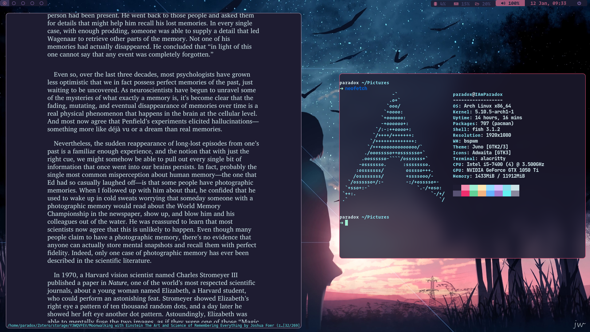

# BSPWM on Arch Linux rice

##Screen Shots of Enignum OS

### Applications Used
1. Terminal alacritty
2. Polybar
3. Fonts Operator Mono, JetBrains Mono
4. Zathura
5. Spotify
6. Picom
7. Neofetch
8. Neovim
9. Tmux
10. D_menu

